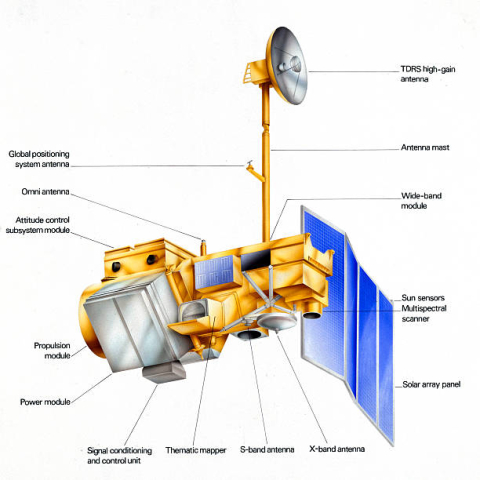
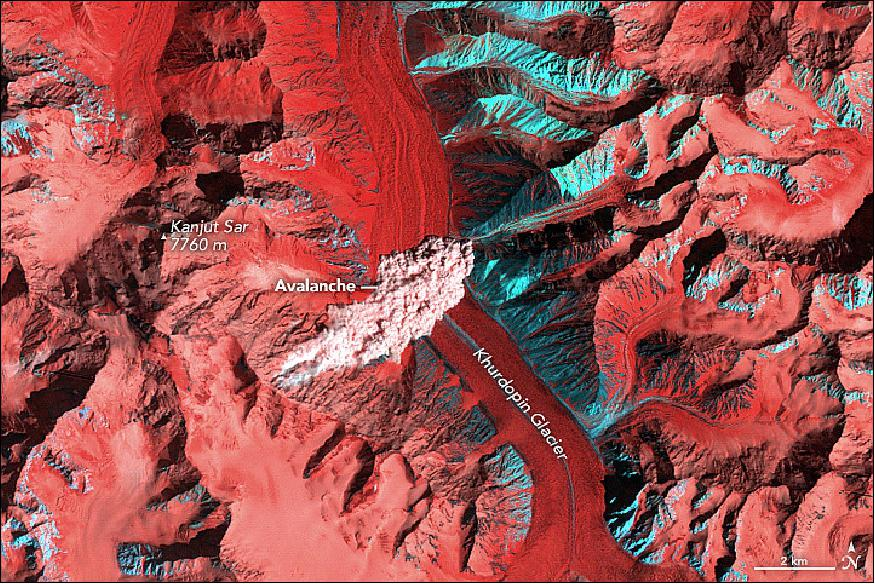

```{r setup, include=FALSE}
knitr::opts_chunk$set(echo = TRUE)
```

class: inverse, center, title-slide, middle

<style>
.title-slide .remark-slide-number {
  display: none;
}
</style>


<a href="https://your-url" class="github-corner" aria-label="View source on Github"><svg width="80" height="80" viewBox="0 0 250 250" style="fill:#fff; color:#151513; position: absolute; top: 0; border: 0; right: 0;" aria-hidden="true"><path d="M0,0 L115,115 L130,115 L142,142 L250,250 L250,0 Z"></path><path d="M128.3,109.0 C113.8,99.7 119.0,89.6 119.0,89.6 C122.0,82.7 120.5,78.6 120.5,78.6 C119.2,72.0 123.4,76.3 123.4,76.3 C127.3,80.9 125.5,87.3 125.5,87.3 C122.9,97.6 130.6,101.9 134.4,103.2" fill="currentColor" style="transform-origin: 130px 106px;" class="octo-arm"></path><path d="M115.0,115.0 C114.9,115.1 118.7,116.5 119.8,115.4 L133.7,101.6 C136.9,99.2 139.9,98.4 142.2,98.6 C133.8,88.0 127.5,74.4 143.8,58.0 C148.5,53.4 154.0,51.2 159.7,51.0 C160.3,49.4 163.2,43.6 171.4,40.1 C171.4,40.1 176.1,42.5 178.8,56.2 C183.1,58.6 187.2,61.8 190.9,65.4 C194.5,69.0 197.7,73.2 200.1,77.6 C213.8,80.2 216.3,84.9 216.3,84.9 C212.7,93.1 206.9,96.0 205.4,96.6 C205.1,102.4 203.0,107.8 198.3,112.5 C181.9,128.9 168.3,122.5 157.7,114.1 C157.9,116.9 156.7,120.9 152.7,124.9 L141.0,136.5 C139.8,137.7 141.6,141.9 141.8,141.8 Z" fill="currentColor" class="octo-body"></path></svg></a><style>.github-corner:hover .octo-arm{animation:octocat-wave 560ms ease-in-out}@keyframes octocat-wave{0%,100%{transform:rotate(0)}20%,60%{transform:rotate(-25deg)}40%,80%{transform:rotate(10deg)}}@media (max-width:500px){.github-corner:hover .octo-arm{animation:none}.github-corner .octo-arm{animation:octocat-wave 560ms ease-in-out}}</style>

# Landsat 5 Thematic Mapper
## Week 2 
### Centre for Advanced Spatial Analysis

`r icons::fontawesome("envelope-square")`: .link-style1[[ucfnaem@ucl.ac.uk](mailto:ucfnaem@ucl.ac.uk)]

`r icons::fontawesome("github")` .link-style2[[Github](https://your-url)]


```{r, echo=FALSE, out.width='15%'}
knitr::include_graphics('https://citygeographics.files.wordpress.com/2011/08/casalogo_bw.png')
```
---
class: inverse

```{r xaringan-logo, echo=FALSE}

xaringanExtra::use_logo(
image_url = 'https://citygeographics.files.wordpress.com/2011/08/casalogo_bw.png',
position = xaringanExtra::css_position(bottom = "1em", left = "1em")
)
```


# Contents

###- Historical overview 
###- Development & Technical Spec 
###- Purpose: General & Within National Parks
###- Visualisations 
###- Overview 


---

### Landsat 5 - Pub quiz trivia

.pull-left[
```{r, echo=FALSE, out.width='100%'}
knitr::include_graphics('https://upload.wikimedia.org/wikipedia/commons/4/4f/Landsat5.jpg')
```
*Landsat-5's influence is still seen to this day* 


]

.pull-right[ 
.my-style[- A joint effort between NASA and U.S. Geological Survey (USGS)

- Carried two primary instruments, a multi spectral scanner &amp; thematic mapper

- Contributed greatly to the understanding of Earths landmasses &amp; coastal areas

- Was set to be decommissioned in 1989. Only being saved by protests from U.S. Congress as well as foreign and domestic data users, leading to an intervention by the Vice President.

- In part, led to the Land Remote Sensing Policy Act of 1992, which instructed Landsat Program Management to build a government-owned Landsat 7

- There were numerous issues within its power system &amp; data transmission

- Set a Guinness World Record at the time for 'Longest Operating Earth Observation Satellite'. And would have been, at that time, of drinking age (if human) at 29 years, 3 months, and 4 days old. ]]


---

```{r xaringan-panelset, echo=FALSE} 
xaringanExtra::use_panelset()
```

###Development & technical information

.pull-left[ 
.panelset[
.panel[.panel-name[Development]
- Mission to collect and detail images of the planets surface
- Launched on March 1, 1984
- Expectancy 3 years, lasted 29!
- NASA and USGS collaboration
- Was nationaled, privatised & nationalised again!
- Launched from Vandenberg Air Force Base, CA U.S.
]

.panel[.panel-name[Technical info]
- Altitude: 705km
- Inclination 98.2 degrees
- Orbit: Polar, sun-synchronous
- Repeat Coverage: 16 days
- Equatorial Crossing Time: 9:45 AM
- Period of Revolution ~ 14.5 orbits per day
]
]
]

.pull-right[

```{r, echo=FALSE, out.width='100%'}

```

]


---
class: inverse, center, middle 

**Evident in the research of this satellite are the many faults that occurred**


--

```{r, echo=FALSE, out.width='90%'}
knitr::include_graphics('fault.jpg')
```
---
### Sensor Information - Thematic Mapper 


.panelset[
.panel[.panel-name[Overview]

.pull-right[A high resolution scanner with 7 spectral bands that cover a 185 x 185 km area. The Thematic Mapper sensor proved its signaficance with its improved resolution in comparison to those that came before. The sensor captured data in 7 bands, including thermal infrared. The swath width allowed Landsat to cover the entire earths surface in a repeated 16 day cycle. This, couples with high resolution allowed the sensor to detect detailed areas, and gave a great source of analysis to track changes over time for factors such as urban expansion, deforestation and the environment.]

.pull-left[
 


]
]


.panel[.panel-name[Technical]
- Sensor type: Imaging radiometer 
- Resolution class: High (5 - 30m)
- Spatial resolution 30 m (VIS & IR), 120m (Thermal)
- Spectral bandwith between bands 1 - 7 (see image)
- Swatch width 185km

.pull-right[
```{r, echo=FALSE, out.width='100%'}
knitr::include_graphics('spectralbandwith.png')
```
]
]]

---


###Application

.my-style[*Capturing a rare, high-speed avalanche on Kanjut Sar, a peak in the Karakorum Range, Pakistan. By combining infrared, red, and green wavelengths into a false-color image, the TM highlighted the avalanche's path and impact on the terrain, including its interaction with Khurdopin Glacier and a significant medial moraine indicative of glacial surges*]


.center[
```{r, echo=FALSE, out.width='80%'}

```
]

---
class: inverse

###Application cont.

.pull-left[
```{r, echo=FALSE}
knitr::include_graphics('nationalpark.png')
```
]

.pull-right[
When starting this week I thought *'how will I implement this in my day-to-day knowledge seeking trivial fact dad joke way'.* Of course that morning I had been watching a video on the most interesting U.S. president to exist... **Teddy Roosevelt and legacy with national parks**

With this I found that the  thematic mapper had been used to track glacier withdrawal in Montanas glacier national park. Predicted to have fully melted by 2030. 
This gives a clear reflection on not only a use for a need of conservation like Roosevelt pioneered, but a given example of the effects of climate change too.

]

---

class: inverse

### Reflection

--

The Landsat 5 Thematic Mapper (TM) was a breakthrough in Earth observation, offering high-resolution imagery across seven spectral bands, enabling detailed analysis of the planet's surface for over 28 years, far exceeding its expected lifespan. Its advantages included versatile applications in environmental monitoring, improved spatial resolution for detailed observations, and an extensive data record crucial for long-term change analysis. However, challenges included the need for substantial data storage and processing capabilities, limited thermal band resolution, and a 16-day revisit cycle that could miss rapid environmental changes. Despite these drawbacks, TM's legacy is its significant contribution to advancing remote sensing and enhancing our understanding of Earth's natural and human-made environments.

